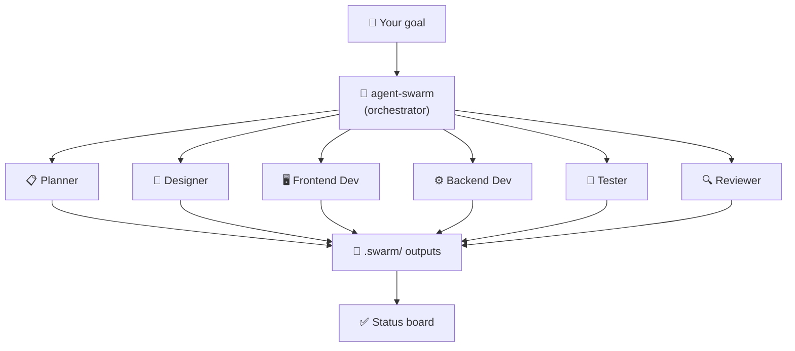
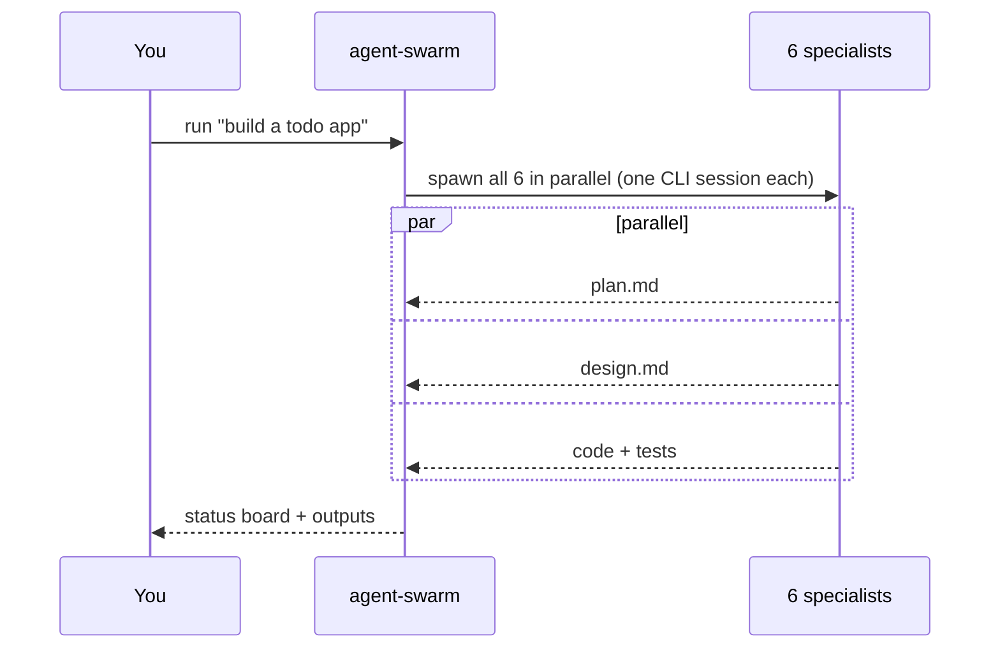

# 🤖 agent-swarm

[](https://www.npmjs.com/package/@hosnainrafi/agent-swarm)
[](https://www.npmjs.com/package/@hosnainrafi/agent-swarm)
[](https://opensource.org/licenses/MIT)
[](https://nodejs.org)
[](https://github.com/HosnainRafi/agent-swarm)

> **One goal. Six specialist AI agents. Zero extra API keys.**
> Turn any CLI coding assistant into a parallel swarm — a planner, designer, frontend, backend, tester, and reviewer all working *at the same time*, on the credit you already pay for.

---

## What is agent-swarm?

agent-swarm is a universal orchestrator that spawns a **team of AI subagents** inside the CLI coding assistant you already use — Claude Code, Codex, Gemini CLI, Qwen Code, **ZCode (Z.ai/GLM)**, OpenCode, or Copilot CLI.

Claude Code has a great feature: you ask it to spawn subagents that work in parallel. But that pattern is locked to Claude Code. agent-swarm brings the **same pattern to every CLI coding assistant** — **no external APIs, no extra keys, no extra credit account.**



## 🎯 The "own credit, no CLI" path — `agent-swarm swarm`

If you don't want to install or log into **any** CLI, this is the answer. `swarm` prints a single self-contained prompt that makes **any AI assistant** — ZCode, ChatGPT, Claude Code, Codex, Gemini — spawn its own 6 specialist subagents natively, on **its own account/credit**, with zero external CLI and zero new keys.

```bash
npx @hosnainrafi/agent-swarm swarm "build a dark-mode todo app"
```

Copy the printed prompt into the AI. It tells the AI to spawn Planner → Designer → Frontend → Backend → Tester → Reviewer **in parallel**, each using that AI's own native subagent feature, then report a status board.

> 💡 This is the **only** way to truly "use the AI's own credit" — no CLI binary can borrow another app's internal login. `run` fans out across *installed CLI agents*; `swarm` makes *the AI itself* fan out.

## ✨ Features

- ⚡ **Truly parallel** — all 6 specialists run simultaneously in one wave (no blind waiting).
- 🔑 **No new keys** — reuses the login/subscription you already have. agent-swarm never calls an AI API.
- 🌍 **Universal** — one pattern across Claude Code, Codex, Gemini, Qwen, ZCode, OpenCode, Copilot.
- 💸 **Cost-aware** — `fast` and `economy` modes to control your token budget.
- 📦 **Zero dependencies** — plain Node.js, no build step, no external services.
- 🪟 **Cross-platform** — macOS, Linux, and Windows.

## Supported assistants

| Assistant | Parallel swarm | Native in-session subagents |
|---|---|---|
| Claude Code | ✅ | ✅ (agent teams) |
| Codex CLI | ✅ | ✅ (in-session) |
| Gemini CLI | ✅ | ✅ (`/agent`) |
| Qwen Code | ✅ | ✅ (`/agent`) |
| ZCode (Z.ai/GLM) | ✅ | ✅ (in-session) |
| OpenCode | ✅ | ✅ (`/delegate`) |
| Copilot CLI | ✅ | — |
| ChatGPT (web) | ❌ no CLI | — |

> 💡 **ChatGPT (web) has no CLI**, so agent-swarm can't drive it. For OpenAI, use **Codex CLI** — same OpenAI login/credits, no extra key.

## Demo

```text
$ npx @hosnainrafi/agent-swarm run "build a todo web app with dark mode"

━━━ Swarm estimate ━━━
  Mode:      fast (1 wave, max 8 concurrent)
  Agents:    6 specialists — Planner, Designer, Frontend, Backend, Tester, Reviewer
  Consumed from: your existing Claude Code / Codex subscription — no new keys.

▶ Planner (Claude Code)…
▶ Designer (Claude Code)…
▶ Frontend (Codex)…
▶ Backend (Codex)…
▶ Tester (Claude Code)…
▶ Reviewer (Codex)…

━━━ Status board ━━━
  ✔ planner   — done (32s)
  ✔ designer  — done (28s)
  ✔ frontend  — done (41s)
  ✔ backend   — done (36s)
  ✔ tester    — done (22s)
  ✔ reviewer  — done (19s)

✔ Swarm complete (6/6 agents succeeded). Outputs in .swarm/.
```

## How it works



Every specialist runs as its own session of your existing assistant. Specialists share context through the `docs/` folder and the `.swarm/` status directory, so they effectively work **simultaneously on your project**.

## Install

```bash
npm install -g @hosnainrafi/agent-swarm
```

Or run once without installing:

```bash
npx @hosnainrafi/agent-swarm run "your goal"
```

## Quick start

```bash
# 1. Make sure your CLI agent is installed and logged in:
claude login        # or: codex auth / gemini auth / qwen auth

# 2. Spawn the team:
npx @hosnainrafi/agent-swarm run "build a todo web app with dark mode and local storage"

# 3. Watch the status board — every specialist works simultaneously:
#    ✔ planner ✔ designer ✔ frontend ✔ backend ✔ tester ✔ reviewer
```

## Teams

**standard** — plan → design → build in parallel → test → review. Specialists: Planner, Designer, Frontend Dev, Backend Dev, Tester, Reviewer.

**research** — three agents investigate the same question from different angles at the same time: a supporter, a devil's advocate, and a synthesizer who reads both reports and writes the final answer.

**bugfix** — two debuggers test competing hypotheses in parallel, then a judge compares the fixes, tests each against the failing case, and applies the winner.

## Commands

| Command | What it does |
|---|---|
| `agent-swarm run "<goal>"` | Fan out specialists in parallel (one CLI session each) |
| `agent-swarm native "<goal>"` | Print the exact commands to spawn **true in-session subagents** |
| `agent-swarm swarm "<goal>"` | Print ONE universal prompt — paste into **any** AI to spawn its own 6 subagents on its own credit |
| `agent-swarm detect` | Show which CLI agents are installed on your machine |
| `agent-swarm teams` | List available team templates |

## Modes

agent-swarm ships with two cost modes so you control the token budget:

| Mode | Behavior | Est. token cost |
|---|---|---|
| `--mode fast` (default) | All specialists run simultaneously in one wave | ~N sessions (N = team size) |
| `--mode economy` | Agents grouped in waves of max 3; later waves reuse earlier docs as shared context | ~3 sessions always |

```bash
npx @hosnainrafi/agent-swarm run "build a todo app" --mode economy
# → Swarm estimate: 2 waves, ~3 sessions of tokens
```

## Options

| Flag | Default | Meaning |
|---|---|---|
| `--team <name>` | standard | `standard` · `research` · `bugfix` |
| `--runtime <a,b>` | all installed | Restrict to e.g. `claude,codex` |
| `--concurrent <n>` | 8 | Max parallel sessions |
| `--native` | off | With `run`: also print native in-session subagent commands |

## How the "no extra keys" promise works

| Question | Answer |
|---|---|
| Which AI runs the agents? | The same CLI assistant you already use (Claude Code, Codex, Gemini CLI, Qwen Code…) |
| Whose credits are consumed? | **Yours** — the session uses the login/subscription you already have |
| Does agent-swarm call any AI API? | No. It launches CLI sessions and coordinates them |
| Do I need a new account or token? | No. If `claude` works today, your swarm works today |
| What about ChatGPT (web)? | No CLI, so agent-swarm can't drive it. Use **Codex CLI** — same OpenAI login |
| Does it work on Windows? | Yes — detection uses `where` and output is merged (`2>&1`) for cmd.exe + POSIX |

In short: the key is like the water connection to your house. agent-swarm doesn't add a new pipe company — it just adds a smart pump that uses your existing water.

## Native in-session subagents (the real deal)

`agent-swarm native "<goal>"` prints the commands to spawn genuine in-session subagents — the same thing Claude Code does internally:

**Claude Code** (interactive session):

```bash
export CLAUDE_CODE_EXPERIMENTAL_AGENT_TEAMS=1   # enable agent teams
claude
# then inside Claude Code, ask:
# "spawn a team: planner, designer, frontend, backend, tester, reviewer"
```

**Gemini CLI / Qwen Code:**

```json
// ~/.gemini/settings.json  (or ~/.qwen/settings.json)
{ "experimental": { "enableAgents": true } }
```

Then inside a session: `/agent planner -p "<prompt>"`.

agent-swarm's parallel mode works even where native subagents don't exist (Codex, Copilot CLI, GLM-based CLIs), and works side-by-side with the native mode — run `--native` to get both.

## Advanced

```bash
# Only use Claude Code + Codex (spread work between your two accounts):
agent-swarm run "<goal>" --runtime claude,codex

# Research a question from 3 angles simultaneously:
agent-swarm run "is WebGPU production-ready in 2026?" --team research

# Bug squad with competing hypotheses:
agent-swarm run "app crashes when uploading files larger than 5MB" --team bugfix
```

## FAQ

**Does it use my existing subscription?** Yes — every specialist runs as a session of the CLI you already logged into. One swarm run ≈ N sessions of your normal quota.

**Is it really parallel?** In `--mode fast`, yes — all specialists launch at once in one wave. `--mode economy` groups them to save tokens.

**What if my CLI isn't supported?** Open an issue — adding a runtime is a ~10-line adapter. ZCode, Cursor, Kimi, and others are on the roadmap.

**Can I use it in a CI/CD pipeline?** Yes, run `agent-swarm run "<goal>" --runtime codex` non-interactively.

## Support & contributing

⭐ Star the repo if it saves you time. Pull requests welcome — open an issue to request a new runtime or report a bug.

## License

MIT © [Hosnain Rafi](https://github.com/HosnainRafi)
