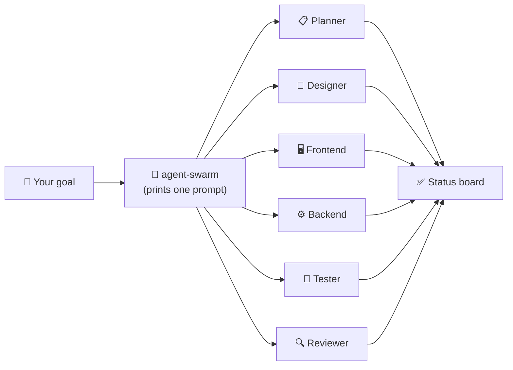

# 🤖 agent-swarm

[](https://www.npmjs.com/package/@hosnainrafi/agent-swarm)
[](https://www.npmjs.com/package/@hosnainrafi/agent-swarm)
[](https://opensource.org/licenses/MIT)
[](https://nodejs.org)
[](https://github.com/HosnainRafi/agent-swarm)

> **One goal. Six specialist agents. Your AI's own credit.**
> A single prompt that turns *any* AI assistant into a parallel swarm — a planner, designer, frontend, backend, tester, and reviewer all working at once. **No external CLIs. No API keys. Nothing to install on the AI's side.**

---

## What is agent-swarm?

agent-swarm is a **prompt generator**. You give it a goal, and it prints one self-contained prompt. Paste that prompt into any AI assistant — ZCode, ChatGPT, Claude Code, Codex, Gemini — and *that* assistant spawns its own 6 specialist subagents natively, in parallel, on its own account.

**No CLI is launched. No API is called.** The swarm runs *inside* the AI you already use, on *the credit you already have*.



## Why this exists

Claude Code can spawn parallel subagents — but that pattern is locked to Claude Code. agent-swarm brings the same pattern to **every** AI assistant, with no CLI and no API integration. It's just a well-crafted instruction.

The core idea: **the AI spawns its own subagents on its own credit.** No external process can borrow another app's login — so agent-swarm doesn't try. It simply tells the AI to do it natively.

## Install

```bash
npm install -g @hosnainrafi/agent-swarm
```

Or run once without installing:

```bash
npx @hosnainrafi/agent-swarm "build a dark-mode todo app"
```

## Usage

```bash
agent-swarm "build a dark-mode todo app"     # default — print the swarm prompt
agent-swarm swarm "build a REST API"         # explicit form
agent-swarm zcode "build a todo app"         # write 6 ZCode subagents + launch prompt
agent-swarm teams                            # show the 6 specialist roles
agent-swarm help                             # help
```

Copy the printed prompt into any AI assistant. That's the whole workflow.

## The prompt it generates

```text
You are about to run a multi-agent swarm using YOUR OWN native subagents
(your built-in agent / subagent feature). Do NOT call any external API, CLI, or
third-party tool — every specialist runs inside you, on your own credit/session.

GOAL: build a dark-mode todo app

Spawn these 6 specialist agents and run them in parallel (simultaneously):

1. Planner   — concise implementation plan (scope, steps, acceptance criteria)
2. Designer  — design spec (tech stack, file structure, visual direction)
3. Frontend  — implement the frontend (write working files)
4. Backend   — implement the backend / data layer (write working files)
5. Tester    — test checklist, then run tests against the built code
6. Reviewer  — audit correctness, security, quality; score 0-10

Rules:
- Each specialist is YOUR OWN subagent on YOUR OWN credit. No external API.
- Run them concurrently. Each records its start time (HH:MM:SS) as its FIRST line.
- When all 6 finish, print a status board: agent -> start time -> one-line result.
- Then assemble and deliver the final result.

Do all of this now.
```

## The 6 specialists

| Role | What it does |
|---|---|
| 📋 Planner | Scope, steps, acceptance criteria |
| 🎨 Designer | Tech stack, structure, visual direction |
| 🖥️ Frontend Dev | Implements the frontend |
| ⚙️ Backend Dev | Implements the backend / data layer |
| 🧪 Tester | Test checklist + runs tests |
| 🔍 Reviewer | Correctness, security, quality (0–10) |

## ZCode (Z.ai / GLM)

ZCode is a **desktop app, not a CLI** — so no Node package can launch it from the command line. What `agent-swarm zcode` does is write the 6 specialist subagents into ZCode's own directory (`~/.zcode/agents/`), then print a one-line launch prompt for you to paste into the ZCode app.

```bash
agent-swarm zcode "build a dark-mode todo app"
```

- Writes `planner.md`, `designer.md`, `frontend.md`, `backend.md`, `tester.md`, `reviewer.md` to `~/.zcode/agents/`.
- Prints a launch prompt → paste it into ZCode, and ZCode runs the 6 subagents on **your GLM credit**.

> Set `ZCODE_AGENTS_DIR` to override where the files are written.

## FAQ

**Does it use my AI's own credit?** Yes. The prompt tells the AI to spawn subagents natively — same account, same credit, no new keys.

**Does agent-swarm call any API or launch any CLI?** No. It only prints text. The multi-agent work happens inside the AI you paste the prompt into.

**Which assistants does it work with?** Any assistant with a native subagent / agent feature: ZCode, ChatGPT, Claude Code, Codex CLI, Gemini, and more.

**How do I know the agents ran in parallel?** Each specialist records its start time (`HH:MM:SS`) as its first output line. If they cluster within seconds, they ran in parallel.

## Support & contributing

⭐ Star the repo if it saves you time. Pull requests welcome — open an issue to report a bug or suggest an improvement.

## License

MIT © [Hosnain Rafi](https://github.com/HosnainRafi)
